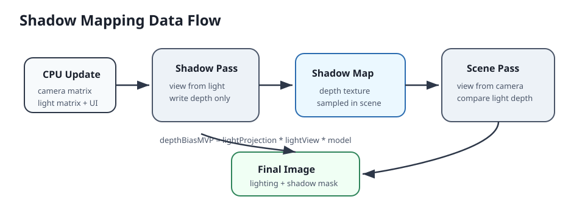
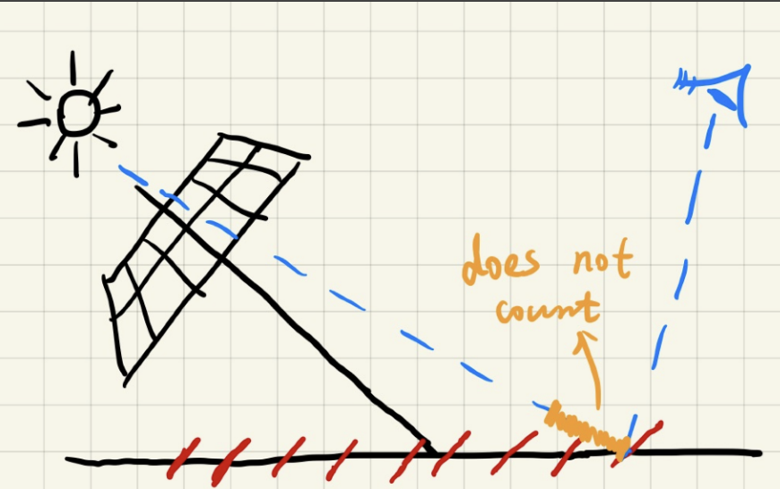
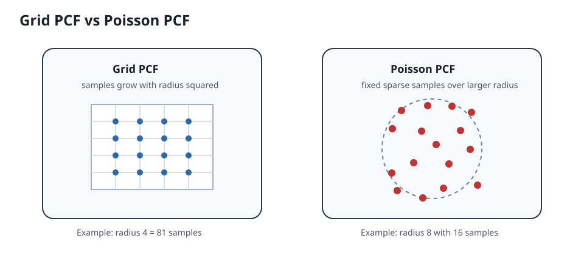
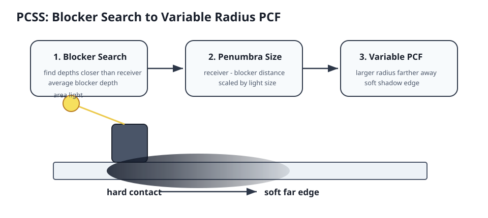
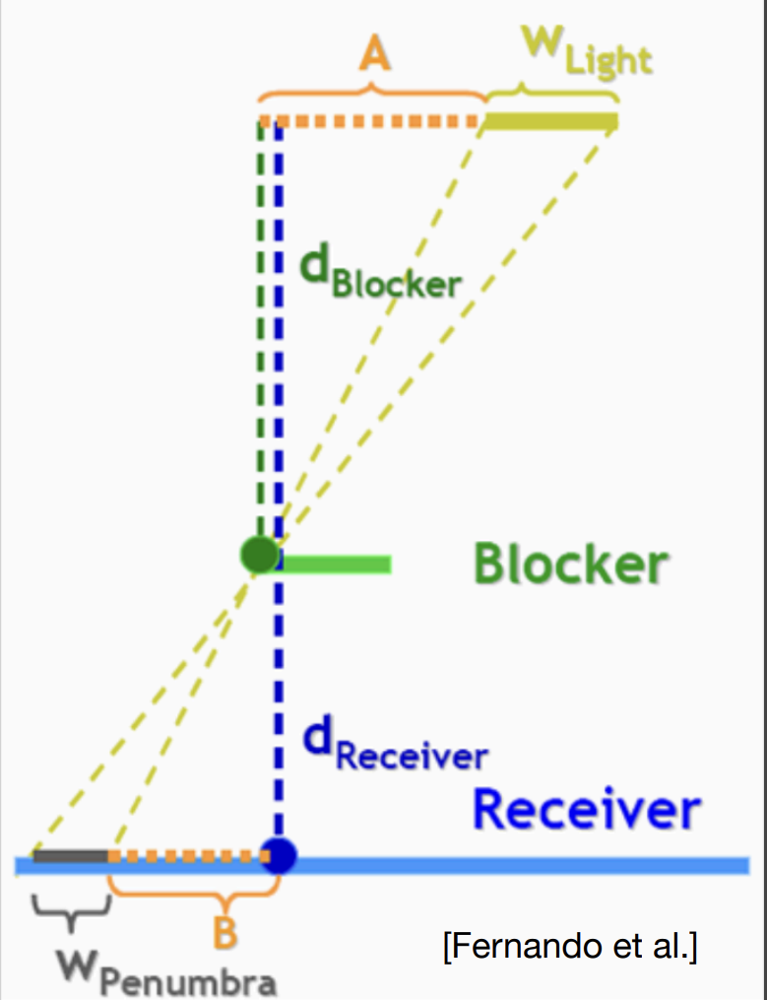

# Lab1: Shadow Mapping

## 1. 实验目标

- 实现基础 Shadow Mapping。
- 对比 Hard Shadow、PCF、Poisson PCF、PCSS。
- 加入 Bias、Debug Views、UI 调参，理解阴影算法的问题和解决方法。

## 2. 项目结构

- `lab1.cpp / lab1.h`：Vulkan 渲染流程、资源、管线、UI。
- `scene.vert / scene.frag`：场景渲染与阴影计算。
- `shadowVertex.vert`：shadow pass 深度写入。
- `light.vert / light.frag`：光源可视化。
- `quad.vert / quad.frag`：shadow map debug 显示。

## 3. Vulkan 渲染流程
- 初始化资源：shadow map、UBO、descriptor、pipeline。
- Shadow Pass：从光源视角写入深度图。
- Scene Pass：从相机视角渲染场景并采样 shadow map。
- Light Debug Pass：绘制光源小球。
- UI Overlay：调节光源、bias、阴影模式。

整体数据流：



```text
CPU 更新光源矩阵 / 相机矩阵 / UI 参数
-> Shadow Pass 使用 light MVP 渲染深度图
-> Shadow Map 作为 depth texture 绑定到 scene pass
-> Scene Pass 把 world position 投影到 light space
-> fragment shader 比较 currentDepth 和 shadowMapDepth
-> 根据 Hard Shadow / PCF / PCSS 输出阴影结果
```

## 4. Shadow Mapping 原理

Shadow Mapping 的核心思想是：先从光源视角渲染一张深度图，记录“光源能看到的最近表面”；再从相机视角渲染场景时，把当前片元重新投影到光源空间，比较当前深度和 shadow map 中保存的最近深度。

```hlsl
float3 shadowCoord = input.lightSpacePos.xyz / input.lightSpacePos.w;
float2 shadowUV = shadowCoord.xy * 0.5 + 0.5;
float currentDepth = shadowCoord.z;
float closestDepth = depthTexture.Sample(depthSampler, shadowUV).r;
```

这里 `currentDepth` 使用的是 `shadowCoord.z`，而不是 `worldPos.y` 之类的世界坐标分量。原因是 shadow map 保存的是光源裁剪空间 / NDC 空间下的深度，比较双方必须处在同一个坐标空间。

本实验中的 descriptor 绑定关系：

```text
scene.frag: Texture2D depthTexture : register(t1)
-> descriptor set layout binding 1
-> VK_DESCRIPTOR_TYPE_COMBINED_IMAGE_SAMPLER
-> shadowMap.shadowTexture.descriptor
-> shadow map image view + sampler
```

## 5. Bias 处理


###  Shadow acne 问题
1. `Shadow Pass` 中的 `Rasterizer Depth Bias`，调用`vkCmdSetDepthBias`，从光源视角渲染深度图的时候就对写入的shadow map的深度值进行偏移。
```
depthBiasConstant:
    固定深度偏移量，用于整体减少自阴影。

depthBiasSlope:
    斜率相关 bias，表面越倾斜，bias 越大。

depthBiasClamp:
    对 bias 进行限制，本实验中设置为 0.0。
```

需要对shadow pass的`pipeline rasterization state`中开启
```C++
rasterizationState.depthBiasEnable = VK_TRUE;
```
  2. Fragment Shader中的动态Bias
```hlsl
float computeBias(float3 N, float3 L) {
    float ndotL = saturate(dot(N, L));
    float bias = max(pushConstan.minShadowBias, pushConstan.slopeShadowBias * (1 - ndotL));
    return bias;
}
```

```
表面越正对光源：
    ndotL 越大，深度误差相对较小，bias 可以较小。

表面越倾斜：
    ndotL 越小，shadow map 中一个 texel 覆盖的深度变化更大，更容易产生 acne，因此需要更大的 bias。
```

### Peter panning 问题
bias调整过大会导致这个问题，目前通过调整bias参数解决这个问题。

## 6. 引入噪声 Poisson Disk 随机旋转
在 PCF / PCSS 中，如果每个片元都使用同一组固定的 Poisson Disk 采样点，阴影边缘可能会出现较明显的固定采样 pattern。为减少这种规则感，本实验引入了一个简单的 2D 随机旋转方法。
```hlsl
float random01(float2 p) {
    // 白噪声函数，基于sin和dot的哈希函数，生成一个0到1之间的随机数
    return frac(sin(dot(p, float2(12.9898, 78.233))) * 43758.5453);
}

float2 rotate2D(float2 v, float angle) {
    // 逆时针二维旋转矩阵，三角函数公式推导出来
    float cosAngle = cos(angle);
    float sinAngle = sin(angle);
    return float2(v.x * cosAngle - v.y * sinAngle, v.x * sinAngle + v.y * cosAngle);
}
```

## 7. PCF
1. 方法一：遍历均匀采样，采样数`(radius * 2 + 1) ^ 2`
2. 方法二：泊松均匀采样, 采样数自定义`sampleCount`



```hlsl
float calculatePCF(float2 shadowUV, float currentDepth, float bias, float radius = 3) {
    uint shadowWidth;
    uint shadowHeight;
    depthTexture.GetDimensions(shadowWidth, shadowHeight);  // 获取尺寸

    float2 texelSize = 1.0 / float2(shadowWidth, shadowHeight); // 单位格子
    float shadow = 0.0f;
    int sampleCount = 0;

    if (pushConstan.usePoissonDisk == 1) {  // 泊松圆盘采样
        sampleCount = pushConstan.PoissonSampleCount;
        [unroll]
        for (int i = 0; i < sampleCount; ++i) {
            float2 offset = poissonDisk[i] * radius * texelSize;
            float angle = random01(shadowUV * 4096) * 6.2831853;
            offset = rotate2D(offset, angle); // 随机旋转，减少重复采样带来的伪影
            shadow += shadowCompare(shadowUV + offset, currentDepth, bias);
        }
    }
    else {
        sampleCount = (radius * 2 + 1) * (radius * 2 + 1);
        for (int x = -radius; x <= radius; ++x) {  // 根据半径调整采样范围
            for (int y = -radius; y <= radius; ++y) {
                float2 offset = float2(x, y) * texelSize;
                shadow += shadowCompare(shadowUV + offset, currentDepth, bias);
            }
        }
    }
    return shadow / float(sampleCount);
}
```

传统方形 PCF 的采样数随半径平方增长：

```text
radius 1 -> 9 samples
radius 2 -> 25 samples
radius 4 -> 81 samples
radius 8 -> 289 samples
```

Poisson PCF 的采样数量由 `PoissonSampleCount` 控制，例如 16 samples。半径增大时，Poisson 采样主要扩大过滤范围，而不会像方形 PCF 那样让采样数平方增长。

## 8. PCSS


### 8.1 Blocker Search
遮挡物搜索也引入随机旋转，并且处理无遮挡的情况
```hlsl
// PCSS平均遮挡深度计算
float findAvgBlockerDepth (float2 shadowUV, float currentDepth, float bias, float2 texelSize, float searchRadius) {
    float blockerDepthSum = 0.0f;
    int blockerCount = 0;

    [unroll]
    for (int i = 0; i < pushConstan.PoissonSampleCount; ++i) {
        float2 offset = poissonDisk[i] * searchRadius * texelSize;
        float angle = random01(shadowUV * 4096) * 6.2831853;
        offset = rotate2D(offset, angle);
        float2 sampleUV = shadowUV + offset;
        if (sampleUV.x < 0.0 || sampleUV.x > 1.0 || sampleUV.y < 0.0 || sampleUV.y > 1.0) continue;  // 越界无效值检查

        float sampleDepth = depthTexture.Sample(depthSampler, sampleUV).r;
        if (sampleDepth < currentDepth - bias) {
            blockerDepthSum += sampleDepth;
            blockerCount++;
        }
    }

    if (blockerCount == 0) return -1.0; // 无遮挡物，完全受光

    return blockerDepthSum / blockerCount;
}
```

### 8.2 Penumbra Size 估计
```hlsl
    // 根据平均遮挡物深度计算PCF采样半径
    float penumbraRatio = (currentDepth - avgBlockDepth) / avgBlockDepth;
    float fliterRadius = penumbraRatio * pushConstan.lightSize * searchRadius; // 相似三角形推导出的公式变形
    fliterRadius = clamp(fliterRadius, 0.0f, 32); // 硬编码半径范围
```
- 核心公式通过相似三角形推导得出


### 8.3 PCSS 整体流程
整体流程：遮挡物搜索 -> 半影估算Radius -> PCF
```hlsl
float calculatePCSS(float2 shadowUV, float currentDepth, float bias) {
    uint shadowWidth;
    uint shadowHeight;
    depthTexture.GetDimensions(shadowWidth, shadowHeight);  // 获取尺寸
    float2 texelSize = 1.0 / float2(shadowWidth, shadowHeight);
    float searchRadius = 16.0f; // 硬编码搜索半径

    // 遮挡物搜索，获取平均遮挡物深度
    float avgBlockDepth = findAvgBlockerDepth(shadowUV, currentDepth, bias, texelSize, searchRadius);
    if (avgBlockDepth < 0.0f) return 0.0f; // 无遮挡物，完全受光

    // 根据平均遮挡物深度计算PCF采样半径
    float penumbraRatio = (currentDepth - avgBlockDepth) / avgBlockDepth;
    float fliterRadius = penumbraRatio * pushConstan.lightSize * searchRadius; // 相似三角形推导出的公式变形
    fliterRadius = clamp(fliterRadius, 0.0f, 32); // 硬编码半径范围

    // PCF
    return calculatePCF(shadowUV, currentDepth, bias, fliterRadius);
}
```

PCSS 相比普通 PCF 多了一步 blocker search。它的目标不是简单模糊阴影边缘，而是让半影大小随接收点和遮挡物之间的距离变化：

```text
遮挡物离接收面近 -> 半影小 -> 阴影更硬
遮挡物离接收面远 -> 半影大 -> 阴影更软
```

实验中发现：PCSS 如果使用规则方形采样，容易出现明显的断层 / 等高线状伪影；使用 Poisson Disk 和随机旋转后，规则断层会被打散成更自然的噪声。

## 9. Debug Views

本实验加入了多个 debug view，用来定位阴影问题来自哪个阶段：

```text
Normal Render：最终渲染结果
Shadow Mask：查看阴影判断结果，白色为受光，黑色为阴影
Shadow UV：查看 light-space 到 shadow map 的 UV 是否正确
Current Depth：查看当前片元在 light space 中的深度
Closest Depth：查看 shadow map 中记录的最近深度
Shadow Bias：查看动态 bias 的分布
Normal Visualization：查看法线方向是否正确
```

推荐排查顺序：

```text
Normal
-> Shadow UV
-> Current Depth
-> Closest Depth
-> Shadow Mask
-> Shadow Bias
-> Normal Render
```

如果 `Shadow UV` 异常，通常是 light MVP 或 NDC 到 UV 转换有问题。如果 `Closest Depth` 异常，通常是 shadow pass、image layout 或 descriptor 绑定有问题。如果 `Shadow Mask` 异常，则重点检查 depth compare、bias、PCF/PCSS 逻辑。

## 10. 性能与画质观察

当前实验中的主要观察：

- Hard Shadow 最便宜，但边缘锯齿明显。
- 方形 PCF 直观稳定，但半径增大时采样数平方增长，性能下降明显。
- Poisson PCF 以固定采样数近似大范围滤波，高半径下性能明显优于方形 PCF。
- Poisson / 随机旋转会把规则伪影打散，但可能引入少量噪声。
- PCSS 能产生接触处较硬、远离处较软的阴影，更接近面积光源效果。
- PCSS 更依赖不规则采样，否则容易出现断层状伪影。

后续可以补充一张性能表：

| 模式 | 参数 | 采样数 | 帧时间 / GPU 时间 | 观察 |
| --- | --- | --- | --- | --- |
| Hard Shadow | - | 1 | TODO | 边缘硬 |
| PCF | radius 2 | 25 | TODO | 边缘变软 |
| PCF | radius 4 | 81 | TODO | 性能下降 |
| Poisson PCF | 16 samples | 16 | TODO | 性能较好 |
| PCSS | light size TODO | blocker + filter | TODO | 半影变化 |

## 11. 遇到的问题和修复记录

- Descriptor 绑定：`scene.frag` 中 `register(t1/s1)` 对应 descriptor set layout 的 binding 1，绑定的是 shadow map 的 image view 和 sampler。
- Bias 调参：bias 太小会产生 shadow acne，bias 太大容易出现 peter panning。
- `vkCmdSetDepthBias`：需要在 shadow pipeline 的 rasterization state 中开启 `depthBiasEnable`。
- Poisson PCF：一开始容易忘记把 `offset` 加到 `shadowUV` 上，导致看似启用了 Poisson，实际仍是单点采样。
- PCSS：如果不用 Poisson / 随机旋转，动态 filter radius 容易暴露规则采样造成的断层。
- HLSL 编译：实际运行的是 `.spv`，修改 shader 源码后需要重新编译。
- DebugData：越界区域需要谨慎处理，否则 debug view 可能显示未初始化数据。

## 12. 总结和后续计划

本实验完成了从基础 Shadow Mapping 到 PCF、Poisson PCF、PCSS 的完整学习闭环。相比单纯实现效果，这个 Lab 更重要的收获是理解了阴影算法中的空间变换、深度比较、bias、采样分布、软阴影半影估计以及 debug view 的定位方法。

后续计划：

- 补充 RenderDoc 截图，记录 shadow pass depth attachment、descriptor set 和 scene pass 采样。
- 加入 GPU timestamp query，对比 Shadow Pass、Scene Pass 和不同 PCF/PCSS 参数下的耗时。
- 将 dynamic rendering begin/end、descriptor write、pipeline builder 等 Vulkan boilerplate 逐步封装。
- 可视化 light frustum / ortho box，进一步理解 shadow map 精度和投影范围的关系。
- 在后续 Lab 中进入 PBR / IBL / deferred 或 Forward+ 渲染。
