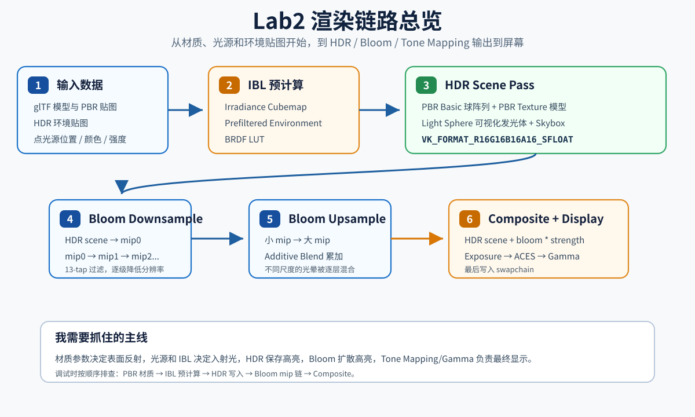
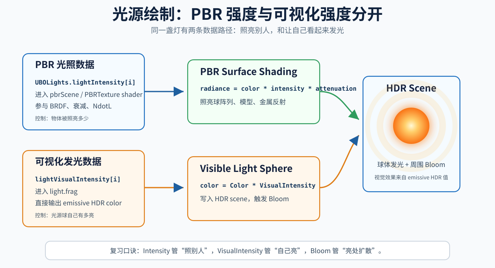
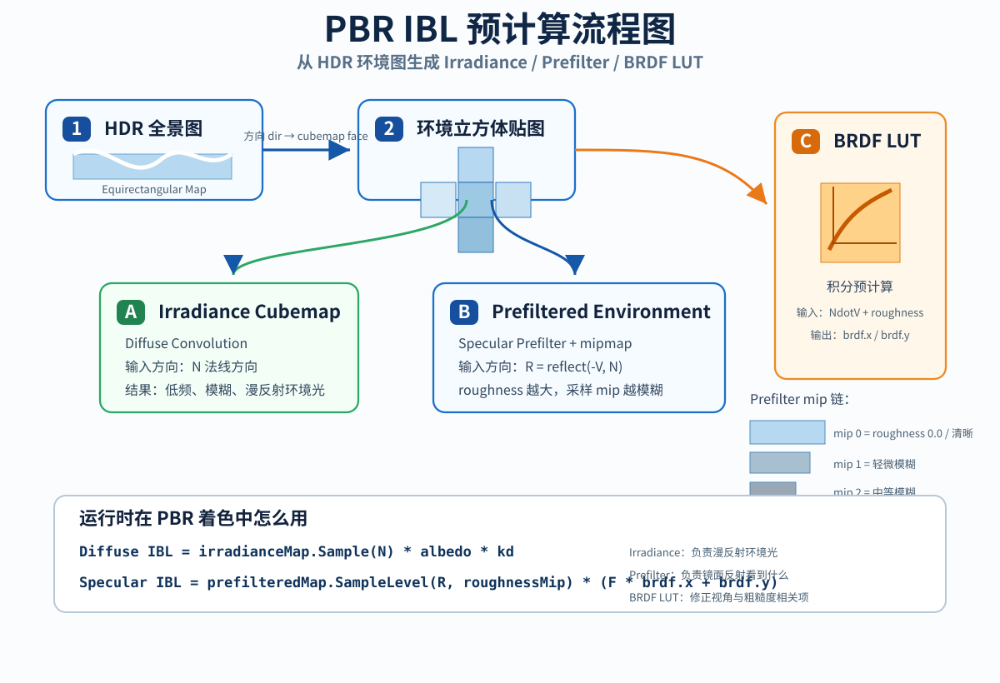
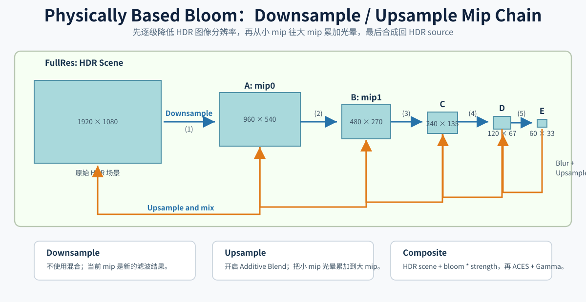

# Lab2 复习笔记：PBR、IBL、贴图与 Physically Based Bloom

这份笔记是我给自己复习 Lab2 用的。Lab2 的目标不是只画出一个好看的场景，而是把一条比较完整的现代实时渲染链路串起来：

```text
PBR Basic
    -> 用 Cook-Torrance BRDF 计算直接光照

PBR IBL
    -> 用环境贴图补上间接光照

PBR Texture
    -> 用 glTF 贴图驱动物体材质

Physical Based Bloom
    -> 在 HDR 线性空间里处理高亮和光晕
```

我最终形成的主线理解是：

```text
材质参数决定表面如何反射光
光源和环境贴图决定入射光从哪里来
HDR render target 保存真实亮度范围
Bloom 从 HDR 高亮里提取视觉光晕
Tone Mapping 和 Gamma 最后负责显示到屏幕
```



## 1. PBR Basic

### 1.1 我在 PBR Basic 里解决的问题

PBR Basic 的核心是：我不再用传统 Blinn-Phong 那种经验模型，而是用更接近物理规律的 Cook-Torrance 微表面模型。

传统高光模型更像是“调一个看起来差不多的高光”，而 PBR 的思路是：

```text
一个表面由很多微小镜面组成
roughness 控制微表面方向有多分散
metallic 控制它更像金属还是非金属
Fresnel 控制视角越贴边反射越强
能量守恒保证漫反射和镜面反射不会随便变亮
```

所以我在 shader 里主要实现了几块：

- `D_GGX`：法线分布函数，描述微表面朝向半程向量的概率。
- `G_Smith`：几何遮蔽项，描述微表面之间的遮挡。
- `F_Schlick` / `F_SchlickRoughness`：Fresnel 近似，描述不同视角下反射率变化。
- `kd / ks`：漫反射和镜面反射比例，用来保持能量分配。

### 1.2 Cook-Torrance BRDF 的结构

我在 shader 里计算直接光照时，本质公式是：

```text
Lo += radiance * BRDF * NdotL
```

其中 `BRDF` 可以拆成：

```text
diffuse + specular
```

漫反射部分：

```hlsl
float3 kd = (1.0 - ks) * (1.0 - metallic);
float3 diffuse = kd * albedo / PI;
```

镜面反射部分：

```hlsl
float D = D_GGX(NdotH, roughness);
float G = G_Smith(NdotV, NdotL, roughness);
float3 F = F_Schlick(HdotV, F0);

float3 specular = D * G * F / max(4.0 * NdotV * NdotL, 0.001);
```

最后：

```hlsl
float3 brdf = diffuse + specular;
Lo += radiance * brdf * NdotL;
```

我需要记住的是：

```text
D 决定高光形状
G 决定掠射角和粗糙表面的遮蔽
F 决定视角相关反射
roughness 越大，高光越宽越暗
metallic 越大，漫反射越少，F0 越接近 albedo
```

### 1.3 metallic 和 roughness 的意义

在 Lab2 里，我用一排球体观察不同 `metallic` 和 `roughness` 的效果：

```cpp
mat.params.metallic = glm::clamp((float)x / (float)(gridSize - 1), 0.1f, 1.0f);
mat.params.roughness = glm::clamp((float)y / (float)(gridSize - 1), 0.05f, 1.0f);
```

这对复习很有帮助：

```text
metallic 接近 0：
    更像塑料、陶瓷、橡胶这类非金属
    漫反射明显
    F0 大约是 0.04

metallic 接近 1：
    更像金、铜、铁这类金属
    基本没有漫反射
    镜面反射颜色来自 albedo

roughness 接近 0：
    表面光滑
    高光集中
    环境反射清晰

roughness 接近 1：
    表面粗糙
    高光扩散
    环境反射模糊
```

### 1.4 光源强度和可视化强度分开

Lab2 后期我还把“PBR 光照强度”和“光源球显示强度”拆开了。

PBR 光照强度在这里：

```cpp
UBOLights.lightIntensity[i]
```

它进入 PBR shader，影响物体被照亮的程度：

```hlsl
float3 radiance = light.lightsColor[i].xyz *
                  light.lightIntensity[i].xyz *
                  attenuation;
```

光源球自己的显示强度在这里：

```cpp
lightVisualIntensity[i]
```

它只进入 `light.frag`：

```hlsl
float3 color = pushconstants.Color.rgb * pushconstants.VisualIntensity.rgb;
```

我这样做的原因是：

```text
PBR 光强控制“灯照别人有多亮”
Visual 强度控制“灯自己看起来有多亮”
```

如果不分开，光源球很容易要么太暗、要么直接过曝成白色。

### 1.5 光源物体的绘制技巧

Lab2 里我画了可见的光源 sphere。这里我需要记住：**这个 sphere 不是 PBR 光源本体，而是光源的可视化物体。**



真实的 PBR 点光源是 shader 里的数学数据：

```cpp
UBOLights.lightsPos[i]
UBOLights.lightsColor[i]
UBOLights.lightIntensity[i]
```

而屏幕上看到的小光球只是一个 mesh：

```text
sphere.gltf
    -> 用 light.vert 移动到点光源位置
    -> 用 light.frag 输出 emissive HDR 颜色
    -> 写入 HDR scene
    -> 参与 Bloom
```

我最终的做法是给光源球单独准备显示强度：

```cpp
glm::vec4 lightVisualIntensity[4] = {
    glm::vec4(14.0f, 14.0f, 14.0f, 1.0f),
    glm::vec4(12.0f, 12.0f, 12.0f, 1.0f),
    glm::vec4(16.0f, 16.0f, 16.0f, 1.0f),
    glm::vec4(10.0f, 10.0f, 10.0f, 1.0f)
};
```

然后通过 push constant 传给 light sphere shader：

```cpp
struct PushconstantsLight {
    glm::vec4 Pos;
    glm::vec4 Color;
    glm::vec4 Intensity;
    glm::vec4 VisualIntensity;
};
```

绘制每个光源球时：

```cpp
pushconstantsLight.Pos = UBOLights.lightsPos[i];
pushconstantsLight.Color = UBOLights.lightsColor[i];
pushconstantsLight.Intensity = UBOLights.lightIntensity[i];
pushconstantsLight.VisualIntensity = lightVisualIntensity[i];

vkCmdPushConstants(
    cmd,
    pipelinesLayout.lightPipelineLayout,
    VK_SHADER_STAGE_VERTEX_BIT | VK_SHADER_STAGE_FRAGMENT_BIT,
    0,
    sizeof(pushconstantsLight),
    &pushconstantsLight
);
```

`light.vert` 只负责把 sphere 放到光源位置：

```hlsl
float4 worldPos = mul(matrices.model, float4(input.pos, 1.0f));
worldPos = worldPos + pushconstants.Pos;
output.pos = mul(matrices.projection, mul(matrices.view, worldPos));
```

`light.frag` 只负责输出可见的发光颜色：

```hlsl
float3 color = pushconstants.Color.rgb * pushconstants.VisualIntensity.rgb;
output.color = float4(color, 1.0f);
```

这里不使用 `pushconstants.Intensity` 是有意的。

我的理解是：

```text
Intensity
    -> 给 PBR shader 用
    -> 决定物体被照亮多少

VisualIntensity
    -> 给 light.frag 用
    -> 决定光源球自己有多亮
    -> 决定它能不能明显触发 Bloom
```

调参时我应该分开想：

```text
物体太暗：
    调 UBOLights.lightIntensity

光源球不像在发光：
    调 lightVisualIntensity

光晕太弱：
    调 lightVisualIntensity 或 bloomStrength

光晕太糊：
    调 bloomFilterRadius 或 bloomStrength

整个画面太亮/太暗：
    调 exposure
```

这个做法也接近现代引擎的设计：真实引擎里通常会有一个 Light Component 负责照明，再用一个 emissive mesh 表示灯泡、灯管、霓虹灯牌等可见发光物体。Bloom 只负责把 HDR 里的高亮扩散成视觉光晕。

## 2. PBR IBL



### 2.1 为什么需要 IBL

只做直接光照时，画面会比较“局部”。没有被点光源照到的地方容易黑掉，金属表面也缺少真实环境反射。

IBL，也就是 Image Based Lighting，用环境贴图来表示来自四面八方的间接光。

我在 Lab2 里使用了一张 HDR 环境贴图，然后从它生成三类资源：

```text
irradianceCubeMap
    -> 漫反射环境光

prefilteredCubeMap
    -> 不同 roughness 下的镜面环境反射

brdfLUT
    -> split-sum approximation 的二维查找表
```

这三张图组合起来，才让 PBR 材质在环境里更自然。

### 2.2 Diffuse IBL：irradiance map

漫反射 IBL 的问题是：

```text
一个点的漫反射不只看一个方向，而是要积分半球方向上的环境光。
```

直接实时积分太贵，所以我预计算 irradiance cubemap。

生成时，我对环境贴图做半球卷积：

```text
对每个 cubemap face
    对每个方向 N
        在 N 对应的半球上采样环境光
        积分得到 irradiance
```

使用时就很简单：

```hlsl
float3 irradiance = irradianceMap.Sample(irradianceMapSampler, N).rgb;
float3 diffuseIBL = kd * albedo * irradiance;
```

我需要记住：

```text
irradiance map 是低频的
它不需要很高分辨率
它主要影响粗糙漫反射表面的环境亮度
```

### 2.3 Specular IBL：prefilter map + BRDF LUT

镜面 IBL 更麻烦，因为它和 roughness 强相关。

光滑表面：

```text
反射方向集中
环境反射清晰
```

粗糙表面：

```text
反射方向分散
环境反射模糊
```

所以我生成了 `prefilteredCubeMap`，把不同 roughness 的卷积结果存在不同 mip 里：

```cpp
prefilterPushconstant.roughness = (float)mip / (float)(numMips - 1);
```

shader 采样时，根据 roughness 选择 mip：

```hlsl
float lod = roughness * float(matrices.mipNums - 1);
float3 prefilterColor = prefilterMap.SampleLevel(prefilterMapSampler, R, lod).rgb;
```

但是只靠 prefilter map 还不够，还需要 BRDF LUT 近似 Fresnel 和几何项的积分：

```hlsl
float2 brdf = brdfLUT.Sample(brdfLUTSampler, float2(NdotV, roughness)).rg;
float3 specularIBL = prefilterColor * (F * brdf.x + brdf.y);
```

我需要记住：

```text
prefilter map 解决“采哪个模糊程度的环境反射”
BRDF LUT 解决“这个视角和粗糙度下反射比例怎么修正”
```

### 2.4 IBL 在 shader 中的合成

最终环境光大概是：

```hlsl
float3 diffuseIBL = computeDiffuseIBL(N, V, albedo, metallic, roughness, F0);
float3 specularIBL = computeSpecularIBL(N, V, F0, roughness);
float3 ambient = diffuseIBL + specularIBL;
```

再加上直接光：

```hlsl
float3 color = ambient + Lo;
```

所以我可以把 PBR 光照分成两部分理解：

```text
Lo
    直接光，来自具体点光源

ambient
    间接光，来自环境贴图 IBL
```

这也是为什么加了 IBL 后，金属球会明显更有“环境感”。

## 3. PBR Texture

### 3.1 为什么要做 PBR Texture

PBR Basic 里，我用 push constant 或 UI 参数控制材质。这样适合观察规律，但真实模型通常不是一个统一材质。

glTF 模型会带多张贴图，例如：

```text
baseColorMap
metallicRoughnessMap
normalMap
occlusionMap
emissiveMap
```

PBR Texture 的目标就是让 shader 不再只依赖手调参数，而是从贴图读取材质数据。

### 3.2 baseColor 和 sRGB

base color 是材质的基础颜色。它通常应该以 sRGB 贴图存储，然后采样时转换到 linear 空间参与光照。

我需要记住：

```text
颜色贴图：baseColor、emissive 通常是 sRGB
数据贴图：normal、metallicRoughness、occlusion 通常是 linear
```

如果颜色空间错了，PBR 结果会明显不对：

```text
sRGB 当 linear 用：颜色会偏暗、对比不对
linear 当 sRGB 用：颜色会偏亮或失真
```

### 3.3 metallicRoughnessMap 的通道

glTF 常见约定是：

```text
metallicRoughness.g -> roughness
metallicRoughness.b -> metallic
```

在 shader 里：

```hlsl
float4 metallicRoughness = metallicRoughnessMap.Sample(metallicRoughnessSampler, uv);
mat.roughness = clamp(metallicRoughness.g, 0.04, 1.0);
mat.metallic = saturate(metallicRoughness.b);
```

我需要特别记住：不是所有贴图都是 RGB 颜色。有些贴图的每个通道都是独立数据。

### 3.4 Normal Map 和 TBN

normal map 存的是切线空间法线。采样后要从 `[0, 1]` 转到 `[-1, 1]`：

```hlsl
float3 tangentNormal = normalMap.Sample(normalSampler, input.uv).xyz * 2.0 - 1.0;
```

然后通过 TBN 矩阵转到世界空间：

```hlsl
float3 T = normalize(input.tangent.xyz);
float3 N = normalize(input.normal);
T = normalize(T - N * dot(N, T));
float3 B = normalize(cross(N, T) * input.tangent.w);

float3 worldNormal = normalize(mul(tangentNormal, float3x3(T, B, N)));
```

我需要记住：

```text
normal map 本身不是世界空间法线
必须结合模型顶点的 normal 和 tangent
tangent.w 常用来表达副切线方向
```

### 3.5 Emissive 贴图和 Bloom 的关系

PBR Texture 中还有 emissive map。它表示材质自己发光，不需要被光源照亮。

shader 里我会把 emissive 乘一个强度：

```hlsl
float emissiveStrength = 100.0;
emissive *= emissiveStrength;
float3 color = ambient + Lo + emissive;
```

这和光源球可视化强度是同一个思想：

```text
emissive 写入 HDR 场景
HDR 高亮进入 Bloom
Bloom 产生发光视觉效果
```

区别是：

```text
emissive map 是模型材质的一部分
lightVisualIntensity 是光源可视化代理的一部分
```

## 4. Physical Based Bloom



### 4.1 为什么 Bloom 必须接在 HDR 后面

Bloom 的本质不是“把颜色涂模糊”，而是模拟相机/人眼看到高亮区域时的光扩散。

所以 Bloom 应该基于 HDR 线性颜色：

```text
场景渲染到 R16G16B16A16_SFLOAT
    -> 保留大于 1 的亮度
Bloom 在 HDR 空间里处理
    -> 高亮区域自然扩散
最后再 tone mapping + gamma
    -> 输出到 swapchain
```

如果我先 tone mapping 到 LDR，再做 Bloom，就会丢掉真实亮度差异。

### 4.2 Lab2 的 HDR 链路

我为 Lab2 创建了 HDR scene color：

```cpp
bloom.hdrFormat = VK_FORMAT_R16G16B16A16_SFLOAT;
bloom.hdrSceneColor = vkutil::createAllocatedImage(
    device,
    allocator,
    VkExtent3D{width, height, 1},
    bloom.hdrFormat,
    VK_IMAGE_USAGE_COLOR_ATTACHMENT_BIT | VK_IMAGE_USAGE_SAMPLED_BIT,
    VK_IMAGE_ASPECT_COLOR_BIT
);
```

场景、PBR 模型、光源球、天空盒都先画到 `bloom.hdrSceneColor`：

```text
cmdDrawSecne
cmdDrawPBRTexture
cmdDrawLight
cmdDrawSkybox
```

然后：

```text
HDR scene -> Bloom downsample -> Bloom upsample -> Composite -> Swapchain
```

### 4.3 Bloom Mip 链

我没有只做一张 blur texture，而是创建了一组逐级变小的 bloom mip：

```cpp
struct BloomMip {
    AllocatedImage image;
    VkDescriptorImageInfo descriptor;
    VkExtent2D extent;
};
```

尺寸大概是：

```text
1/2 resolution
1/4 resolution
1/8 resolution
1/16 resolution
...
```

这样做的好处：

```text
小 mip 负责大范围光晕
大 mip 负责近处细节
多级上采样后 Bloom 更柔和
```

### 4.4 Downsample

Downsample 的过程：

```text
HDR scene      -> bloom.mips[0]
bloom.mips[0] -> bloom.mips[1]
bloom.mips[1] -> bloom.mips[2]
...
```

绑定 descriptor 时我做了一个很重要的设计：

```cpp
VkDescriptorSet srcSet =
    (i == 0)
        ? bloomDescriptorSets.hdrSceneSet
        : bloomDescriptorSets.mipSets[i - 1];
```

意思是：

```text
第 0 层下采样从 HDR scene 读
后续下采样从上一层 bloom mip 读
```

shader 中用 13 tap 采样做降采样滤波：

```hlsl
float2 texelSize = 1.0 / bloomPushConstants.srcResolution;
float3 color = downSample(texelSize, input.UV);
```

我需要记住：

```text
Downsample 不需要 additive blending
它只是把输入图滤波后写到当前 mip
```

### 4.5 Upsample

Upsample 的过程从最小 mip 往回走：

```text
bloom.mips[last] -> bloom.mips[last - 1]
bloom.mips[3]    -> bloom.mips[2]
bloom.mips[2]    -> bloom.mips[1]
bloom.mips[1]    -> bloom.mips[0]
```

我在 upsample pipeline 里开启了 additive blending：

```cpp
.enableAdditiveBlending();
```

并且目标 attachment 用 load：

```cpp
VK_ATTACHMENT_LOAD_OP_LOAD
```

这样上采样输出会加到目标 mip 原有内容上：

```text
dst = dst + srcBlurred
```

这一步非常关键，因为 Bloom 的层次感就是靠不同 mip 的光晕逐层加回来。

我需要记住：

```text
Upsample 需要 additive blending
Downsample 不需要
Composite 通常也不需要 pipeline blending
```

### 4.6 Composite、Tone Mapping 和 Gamma

最终合成时，我同时采样：

```text
binding 0 -> HDR scene
binding 1 -> bloom.mips[0]
```

shader 里：

```hlsl
float3 hdrColor = hdrScene.Sample(hdrSampler, input.UV).rgb;
float3 bloomColor = bloomTexture.Sample(bloomSampler, input.UV).rgb;

if (pushConstants.enableBloom == 0) {
    bloomColor = float3(0.0, 0.0, 0.0);
}

float3 color = lerp(hdrColor, hdrColor + bloomColor, pushConstants.bloomStrength);
color *= pushConstants.exposure;
color = ACESFilm(color);
color = pow(saturate(color), 1.0f / 2.2f);
```

我的理解是：

```text
HDR scene + Bloom
    -> 仍然在线性 HDR 空间

exposure
    -> 控制进入 tone mapping 前的整体亮度

ACESFilm
    -> 把 HDR 压到显示范围

gamma correction
    -> 转成适合屏幕显示的非线性颜色
```

这也是为什么 tone mapping 和 gamma 必须放在最后，而不是放在 PBR shader 里。

### 4.7 Physically Based Bloom 和传统 Bloom 的区别

传统 Bloom 经常会做 bright-pass threshold：

```text
只提取超过某个亮度阈值的像素
```

Physically Based Bloom 更倾向于：

```text
不硬切高亮
让 HDR 中真实较亮的像素自然进入 bloom chain
通过强度、曝光、filter radius 控制效果
```

我现在的做法更接近这个方向。只要 HDR 场景里某些区域足够亮，它们就会自然贡献 Bloom。

## 5. Lab2 的整体渲染顺序

我可以用下面的流程复习整个 Lab2：

```text
prepare
    createVmaAllocator
    loadAssets
    createDescriptorsPool

    generateIrradianceCubeMap
    generatePrefilteredCubeMap
    generateBRDFLUT

    createBloomResources
    createBloomDescriptorSets

    createUniformBuffers
    setupDescriptors
    createPipelines

每帧 render
    prepareFrame
    updateUniformBuffers
    buildCommandBuffer
    submitFrame

buildCommandBuffer
    HDR scene image: UNDEFINED -> ATTACHMENT
    draw PBR basic objects
    draw PBR textured model
    draw visible light spheres
    draw skybox
    HDR scene image: ATTACHMENT -> SHADER_READ

    swapchain image: UNDEFINED -> ATTACHMENT
    bloom downsample
    bloom upsample
    bloom composite + tone mapping + gamma + UI
    swapchain image: ATTACHMENT -> PRESENT
```

## 6. 我最需要记住的坑

### 6.1 Tone Mapping 只能做一次

PBR shader、skybox shader、texture shader 都应该输出线性 HDR。

最终只在 composite shader 中做：

```hlsl
color = ACESFilm(color);
color = pow(saturate(color), 1.0f / 2.2f);
```

如果前面 shader 已经 tone map，后面又 tone map，就会双重压缩，画面会发灰、亮度关系不对。

### 6.2 Descriptor set 要和 mip 语义对应

我最后的设计是：

```cpp
hdrSceneSet
    -> 采样 HDR scene

mipSets[i]
    -> 采样 bloom.mips[i]

compositeSet
    -> 同时采样 HDR scene 和 bloom.mips[0]
```

这样下采样和上采样不会 off-by-one。

### 6.3 Layout transition 要按读写状态切

Bloom 里一张图有时是 render target，有时是 sampled texture。

所以需要在 pass 间切换：

```text
ATTACHMENT_OPTIMAL
SHADER_READ_ONLY_OPTIMAL
```

我需要特别注意不能一边作为 color attachment 写，一边又作为 texture 读同一张图。

### 6.4 光源球不是 PBR 光源本体

光源球只是可视化代理。

```text
UBOLights.lightIntensity
    -> 真正照亮物体

lightVisualIntensity
    -> 光源球自己发光，进入 Bloom
```

这让我后面调灯光时不会混乱。

### 6.5 HDR 亮度、Bloom、曝光要一起调

几个参数的职责：

```text
lightIntensity
    -> 改变物体受光

lightVisualIntensity / emissiveStrength
    -> 改变发光物体自身亮度

bloomStrength
    -> 改变 Bloom 加回画面的比例

bloomFilterRadius
    -> 改变光晕扩散范围

exposure
    -> 改变最终进入 tone mapping 的整体亮度
```

如果画面太亮，不一定要降光源强度；可能是 exposure 或 bloomStrength 太高。

如果 Bloom 不明显，不一定要加 bloomStrength；可能是 HDR 输入本身不够亮。

## 7. Lab2 给我的整体收获

Lab2 让我把很多以前分散的概念连成了一条完整链路：

```text
BRDF
    -> 表面如何反射光

IBL
    -> 环境如何提供间接光

PBR Texture
    -> 真实模型如何提供材质参数

HDR
    -> 如何保存超过 1 的真实亮度

Bloom
    -> 如何从 HDR 高亮生成光晕

Tone Mapping
    -> 如何把 HDR 压到屏幕
```

我现在对实时 PBR 的理解不再只是“套公式”，而是知道每一块在整个渲染系统中的位置：

```text
材质不是单独存在的
光照不是单独存在的
后处理也不是单独存在的

它们要在线性空间、HDR 链路和正确的数据流里一起工作
```

如果以后我复习 Lab2，最重要的是先想清楚这条主线：

```text
模型和材质参数
    -> PBR 直接光 + IBL 间接光
    -> HDR scene color
    -> Bloom mip chain
    -> Composite
    -> Tone Mapping
    -> Gamma
    -> 屏幕
```

只要这条线清楚，Lab2 的代码结构就会清楚很多。
